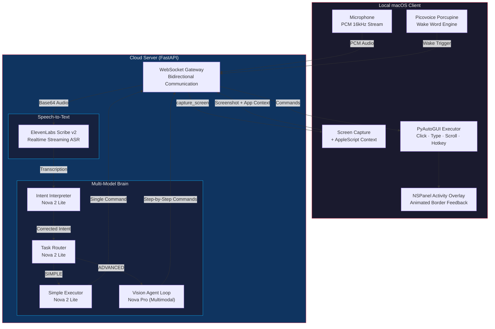
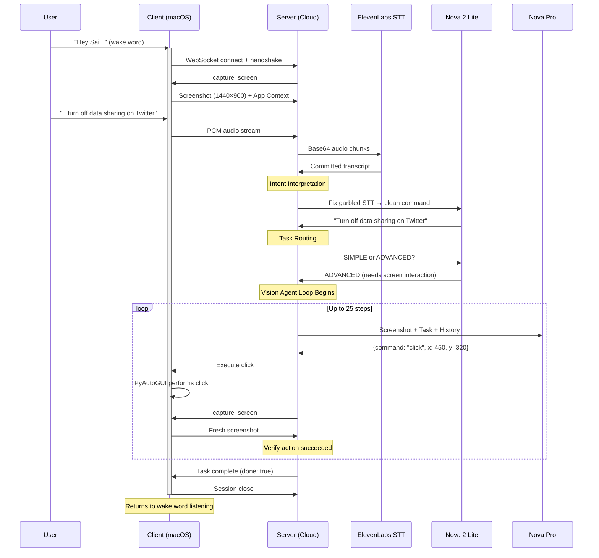
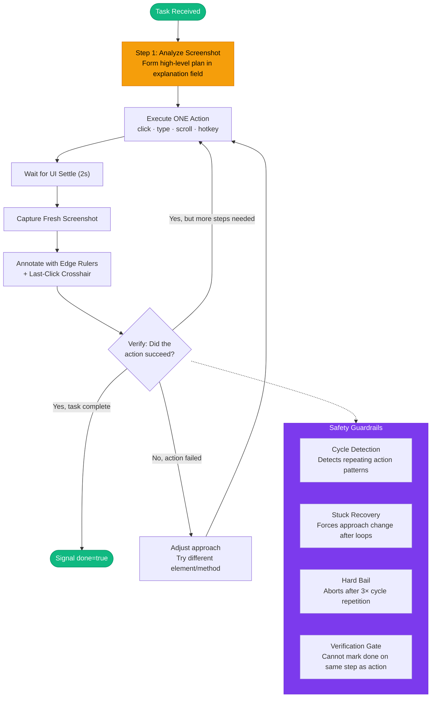

# Sai — Voice-Native Agentic OS Co-Pilot

### Your computer can finally see. Your voice is the only interface you need.

> *"Hey Sai, answer this LeetCode problem."*
> Sai reads the problem from the screen, writes a complete solution in the code editor, and clicks Submit — all from a single voice command.

---

## The Problem

Every voice assistant today is **blind**. Siri, Alexa, and Cortana can set timers and play music, but they cannot see the complex UI you're staring at. They have zero awareness of the browser tab you have open, the form you're filling out, or the code editor you're working in.

Meanwhile, traditional UI automation tools are **brittle** — they rely on DOM selectors, accessibility trees, or hard-coded pixel coordinates that break the moment a website redesigns a button.

**There is no system today that can hear what you want, see what's on your screen, and act on it with human-level understanding.**

## The Solution

**Sai** is a voice-native OS co-pilot that combines real-time speech recognition with Amazon Nova's multimodal vision reasoning to operate your entire macOS desktop — any app, any website, any workflow — through natural voice commands.

Sai doesn't parse HTML. It doesn't read the DOM. It **looks at your screen** the same way a human would, reasons about what it sees, and executes OS-level actions with pixel-perfect accuracy. It works on every application because it operates at the visual layer, not the API layer.

---

## System Architecture



---

## How It Works — End-to-End Flow



---

## The Vision Agent Loop — Deep Dive

This is the core innovation. When a task requires interacting with on-screen content, Sai enters a multi-step **Plan → Act → Verify** agent loop powered by Amazon Nova Pro's multimodal reasoning.



### How the Agent Sees the Screen

Every screenshot sent to Nova Pro is processed through Sai's **Annotated Vision Pipeline**:

1. **Native Capture** — macOS `screencapture` grabs the full Retina display (e.g., 2560×1600)
2. **Canvas Normalization** — Downsampled to a fixed 1440×900 logical canvas via LANCZOS resampling
3. **Edge Ruler Annotation** — Red tick marks at `[200, 400, 600, 800, 1000]` along the top and left edges provide spatial reference without cluttering the UI
4. **Last-Action Crosshair** — A lime-green crosshair marks where the previous click landed, enabling the agent to self-correct drift
5. **Normalized Coordinates** — Nova Pro reasons in a `[0, 1000] × [0, 1000]` coordinate space, making the system resolution-independent

---

## Key Technical Innovations

### 1. Hybrid Multi-Model Routing

Not every voice command needs a 25-step vision agent. Sai uses a **three-tier model hierarchy** to minimize latency:

| Tier | Model | Latency | When Used |
|------|-------|---------|-----------|
| Intent Correction | Nova 2 Lite | ~200ms | Every command — fixes STT errors |
| Task Router | Nova 2 Lite | ~200ms | Every command — classifies SIMPLE vs ADVANCED |
| Simple Executor | Nova 2 Lite | ~200ms | App launches, URL opens, hotkeys |
| Vision Agent | Nova Pro | ~2s/step | Multi-step UI interaction |

"Open Chrome" resolves in under 1 second. "Navigate to Privacy Settings and disable tracking" uses the full agent loop.

### 2. Resolution-Independent Coordinate System

The agent reasons in a normalized `[0, 1000] × [0, 1000]` grid. The client maps these coordinates to actual screen pixels at runtime. This means Sai works identically on:
- 13" MacBook Air (2560×1600 native, 1440×900 logical)
- 27" Studio Display (5120×2880 native)
- Any future Apple display

### 3. Cycle-Aware Stuck Detection

Vision agents can get trapped in action loops (clicking the same 3-4 elements endlessly). Sai implements a **cycle detection algorithm** that identifies repeating patterns of any length (1-6 actions), injects corrective prompts to force strategy changes, and hard-bails if the cycle persists after intervention.

### 4. Strategic Planning Prompts

Instead of "do one action per step," Sai's system prompt enforces **Plan → Act → Verify** discipline. On Step 1, the agent must articulate a numbered high-level plan. Every subsequent step must justify why the action advances the plan. The agent is explicitly instructed that it can **read text from the screenshot** — no need to click on UI elements just to see their content.

### 5. Conversation History Windowing

Multi-step agent loops accumulate large image payloads. Sai implements a **sliding window** over conversation history: the system prompt + initial plan (first exchange) + the 3 most recent exchanges are retained. Older screenshots are pruned to keep the model focused on current state without losing the original strategy.

### 6. Native macOS Activity Overlay

A custom `NSPanel` overlay renders an animated, color-shifting border around the entire screen while Sai is active. It uses `NSWindowCollectionBehaviorCanJoinAllSpaces` to appear across all Spaces and full-screen apps, `setIgnoresMouseEvents_(True)` to remain non-interactive, and automatically suspends during screenshot capture to avoid appearing in the agent's vision.

---

## Amazon Nova Integration

Sai makes deep, multi-layered use of Amazon Nova foundation models:

| Component | Nova Model | Capability Used |
|-----------|-----------|-----------------|
| **Intent Interpretation** | Nova 2 Lite | Text reasoning — corrects garbled speech-to-text using screen context |
| **Task Routing** | Nova 2 Lite | Text classification — determines if task is simple (single action) or advanced (agent loop) |
| **Simple Command Generation** | Nova 2 Lite | Structured output — converts natural language to executable JSON commands |
| **Vision Agent Loop** | Nova Pro | **Multimodal reasoning** — analyzes screenshots, plans multi-step strategies, outputs precise coordinates for UI interaction |

Nova Pro's multimodal capabilities are the foundation of Sai's intelligence. It receives annotated screenshots and must:
- Identify UI elements (buttons, text fields, menus) by visual appearance alone
- Reason about spatial layout to output precise click coordinates
- Track multi-step progress across sequential screenshots
- Understand when a task is complete by visually confirming the result

---

## Tech Stack

| Layer | Technology | Purpose |
|-------|-----------|---------|
| Wake Word | Picovoice Porcupine | Offline, on-device keyword detection ("Hey Sai") |
| Speech-to-Text | ElevenLabs Scribe v2 | Realtime streaming ASR with VAD (WebSocket) |
| Intent + Routing | Amazon Nova 2 Lite | Command interpretation and complexity classification |
| Vision Reasoning | Amazon Nova Pro | Multimodal screenshot analysis and action planning |
| Server Framework | FastAPI | Async WebSocket gateway for client-server communication |
| Screen Capture | macOS `screencapture` + Pillow | Native Retina capture with LANCZOS downsampling |
| OS Execution | PyAutoGUI | Cross-resolution click, type, scroll, and hotkey execution |
| App Context | AppleScript (osascript) | Extracts frontmost app name, browser URL, and tab title |
| Activity Overlay | PyObjC (NSPanel) | Native macOS animated overlay for visual feedback |
| Audio Capture | PyAudio | Low-level PCM microphone streaming at 16kHz |

---

## Setup & Reproducibility

### Prerequisites
- Python 3.11+
- macOS (tested on M1 MacBook Pro, macOS Sonoma)
- Picovoice Access Key — [picovoice.ai](https://picovoice.ai/)
- ElevenLabs API Key — [elevenlabs.io](https://elevenlabs.io/)
- Amazon Nova API Key — via AWS Bedrock or API proxy
- Microphone + Screen Recording permissions granted in System Preferences

### 1. Server

```bash
cd server
pip install -r requirements.txt
```

Create `server/.env`:
```env
AMAZON_NOVA_API_KEY=your_key
NOVA_BASE_URL=https://api.nova.amazon.com/v1
OPENROUTER_API_KEY=your_key
ELEVENLABS_API_KEY=your_key
```

```bash
uvicorn main:app --host 0.0.0.0 --port 8080
```

### 2. Client

```bash
cd client
pip install -r requirements.txt
```

Create `client/.env`:
```env
PICOVOICE_ACCESS_KEY=your_key
```

```bash
python wake_word.py
```

### 3. Use It

1. Say **"Hey Sai"** — the animated border appears
2. Give a command: *"Open Spotify"*, *"Go to twitter.com and turn off data sharing"*, *"Answer this LeetCode problem"*
3. Watch Sai execute — then it returns to listening mode

---

## Example Workflows

| Command | Type | What Sai Does |
|---------|------|---------------|
| *"Open Chrome"* | SIMPLE | Opens Spotlight → types "Chrome" → launches app (~1s) |
| *"Go to github.com"* | SIMPLE | Opens URL directly in the active browser (~1s) |
| *"Turn off data sharing on Twitter"* | ADVANCED | Navigates Settings → Privacy → toggles the correct switch (5-8 steps) |
| *"Answer this LeetCode problem"* | ADVANCED | Reads the problem from the screenshot → clicks code editor → types complete solution → clicks Submit (4-6 steps) |
| *"Search for wireless headphones on Amazon"* | ADVANCED | Clicks search bar → types query → submits search (3-4 steps) |

---

## Why Sai Matters

**Accessibility.** For users with motor disabilities, Sai transforms the entire macOS desktop into a voice-controlled interface — not just a handful of supported apps, but *every* app, *every* website, *every* workflow.

**Universal Automation.** Traditional RPA breaks when UIs change. Sai's visual approach is inherently resilient — it doesn't care if a button moved 50 pixels to the right or if a website redesigned its settings page. It sees the screen and adapts.

**The Future of HCI.** Sai demonstrates that the combination of multimodal AI (Nova Pro) with real-time voice (Nova Lite + ElevenLabs) creates an interaction paradigm that is fundamentally different from chatbots, command lines, or GUI automation scripts. The keyboard becomes optional. The mouse becomes agentic.

---

## Project Structure

```
sai/
├── server/
│   ├── main.py              # FastAPI server — STT, routing, agent loop
│   ├── requirements.txt
│   └── .env                  # API keys (not committed)
├── client/
│   ├── wake_word.py          # macOS client — wake word, capture, execution, overlay
│   ├── HeySai_mac.ppn        # Custom Porcupine wake word model
│   ├── requirements.txt
│   └── .env                  # Picovoice key (not committed)
├── LICENSE                   # MIT
└── README.md
```

---

<p align="center">
  <b>Stop typing. Start speaking. Sai is the future of human-computer interaction.</b>
  <br/><br/>
  Built with Amazon Nova for the <a href="https://amazon-nova.devpost.com/">Amazon Nova AI Hackathon</a> #AmazonNova
</p>
