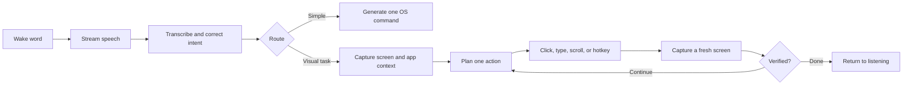

# Sai

**A voice-first macOS agent that sees the screen, reasons through a task, and controls the interface one verified action at a time.**

I built Sai because voice assistants can hear you, and computer-use agents can see a screen, but the two rarely feel like one system.

Say “Hey Sai,” describe a task, and the client captures the current desktop, streams the command to the server, and routes it to either a fast command path or a multimodal action loop. Sai operates at the OS layer rather than through browser-specific DOM selectors, so the same control path can work across native applications and websites.

## How it works


```mermaid
flowchart LR
    A[Wake word] --> B[Stream speech]
    B --> C[Transcribe and correct intent]
    C --> D{Route}
    D -->|Simple| E[Generate one OS command]
    D -->|Visual task| F[Capture screen and app context]
    F --> G[Plan one action]
    G --> H[Click, type, scroll, or hotkey]
    H --> I[Capture a fresh screen]
    I --> J{Verified?}
    J -->|Continue| G
    J -->|Done| K[Return to listening]
```

Most of the system lives in two files:

- `client/wake_word.py` handles the wake word, microphone stream, screen capture, coordinate mapping, macOS overlay, and OS-level execution.
- `server/main.py` handles transcription, intent correction, routing, multimodal reasoning, action history, cycle detection, and WebSocket coordination.

## Core engineering

### Two execution paths

Opening an application or sending a hotkey should not pay the latency cost of a full vision loop. Sai classifies each request as:

- **Simple** — generate and execute a single structured command
- **Visual** — inspect the screen and work through a multi-step plan

### Screenshot-native control

For visual tasks, the client captures the desktop and active-application context, normalizes the image to a stable canvas, and maps model coordinates back to the current display. The agent does not depend on HTML, browser extensions, or app-specific integrations.

### Plan, act, verify

The visual path performs one action at a time. After each click, keystroke, scroll, or hotkey, Sai captures a new screenshot and asks the model to verify what changed before continuing.

This makes failures visible to the loop instead of assuming that an action succeeded.

### Loop recovery

Computer-use agents can repeat the same unsuccessful action indefinitely. Sai records recent actions, detects repeated patterns, injects recovery guidance, and stops after a bounded number of failed cycles.

### Native feedback

A lightweight `NSPanel` draws an activity border across macOS Spaces while Sai is active. The overlay ignores mouse events and disappears during screen capture so it does not contaminate the agent's visual input.

## Example tasks

- Open an application or website
- Navigate through a settings flow
- Read a problem shown on screen and enter a response
- Search within an unfamiliar interface
- Chain clicks, typing, scrolling, and hotkeys across multiple steps

Sai is a prototype, so success depends on the visual clarity of the interface and the underlying model. It is not positioned as deterministic or safe for unattended, irreversible workflows.

## Stack

| Layer | Technology |
|---|---|
| Wake word | Picovoice Porcupine |
| Speech-to-text | ElevenLabs streaming transcription |
| Intent and routing | Amazon Nova |
| Visual reasoning | Amazon Nova multimodal models |
| Server | FastAPI + WebSockets |
| Screen capture | macOS `screencapture`, Pillow, AppleScript |
| Input execution | PyAutoGUI |
| Native overlay | PyObjC / AppKit |
| Audio | PyAudio |

## Run locally

### Requirements

- macOS
- Python 3.11+
- Picovoice access key
- ElevenLabs API key
- Amazon Nova access through the configured endpoint

```bash
git clone https://github.com/GodlyDonuts/sai.git
cd sai
bash setup_mac.sh
```

Add the required credentials:

```bash
# server/.env
AMAZON_NOVA_API_KEY=your_key
NOVA_BASE_URL=your_endpoint
OPENROUTER_API_KEY=your_key
ELEVENLABS_API_KEY=your_key

# client/.env
PICOVOICE_ACCESS_KEY=your_key
```

Start the server and client in separate terminals:

```bash
cd server
venv/bin/uvicorn main:app --host 0.0.0.0 --port 8080
```

```bash
cd client
venv/bin/python wake_word.py
```

Sai requires Microphone, Screen Recording, and Accessibility permissions for the terminal or IDE running the client.

## Safety and limitations

Sai can type and click anywhere the current macOS user can. Run it in a controlled environment, supervise visual tasks, and avoid financial, destructive, or otherwise irreversible actions.

The current prototype does not guarantee correct targeting, support every display configuration, or provide a general confirmation policy for sensitive actions. Those are product requirements, not details to hide behind a model prompt.

## Project structure

```text
sai/
  client/
    wake_word.py       wake word, capture, overlay, execution
    HeySai_mac.ppn     custom local wake-word model
  server/
    main.py            transcription, routing, visual agent loop
    test_client.py     lightweight client test
  setup_mac.sh         local environment setup
  LICENSE
```

Built with Amazon Nova for the Amazon Nova AI Hackathon.

## License

MIT
